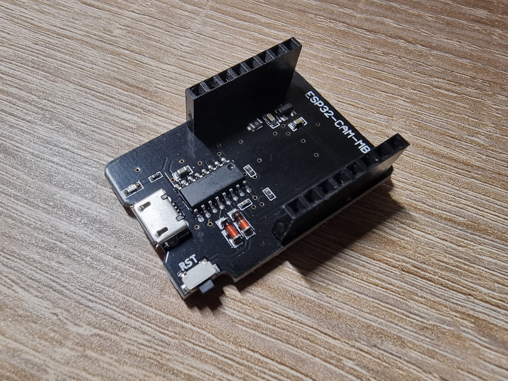
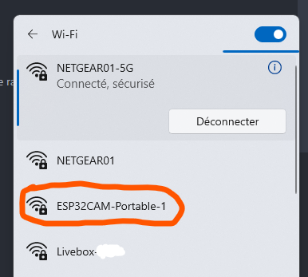
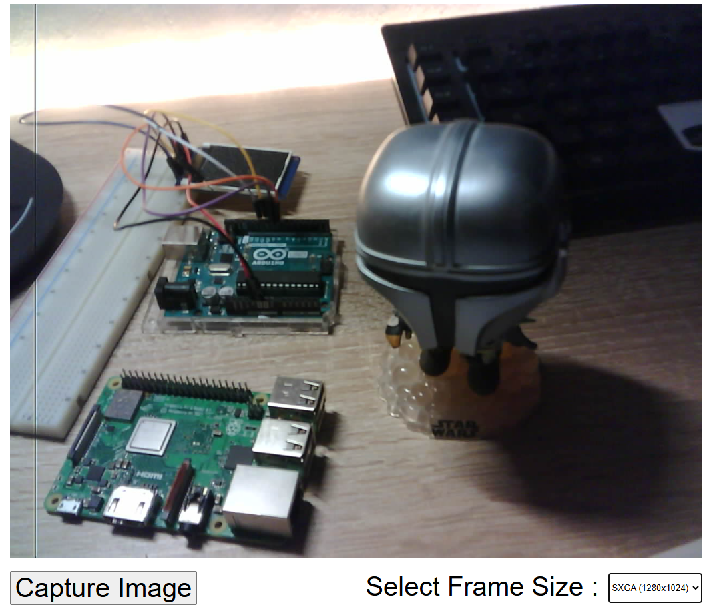
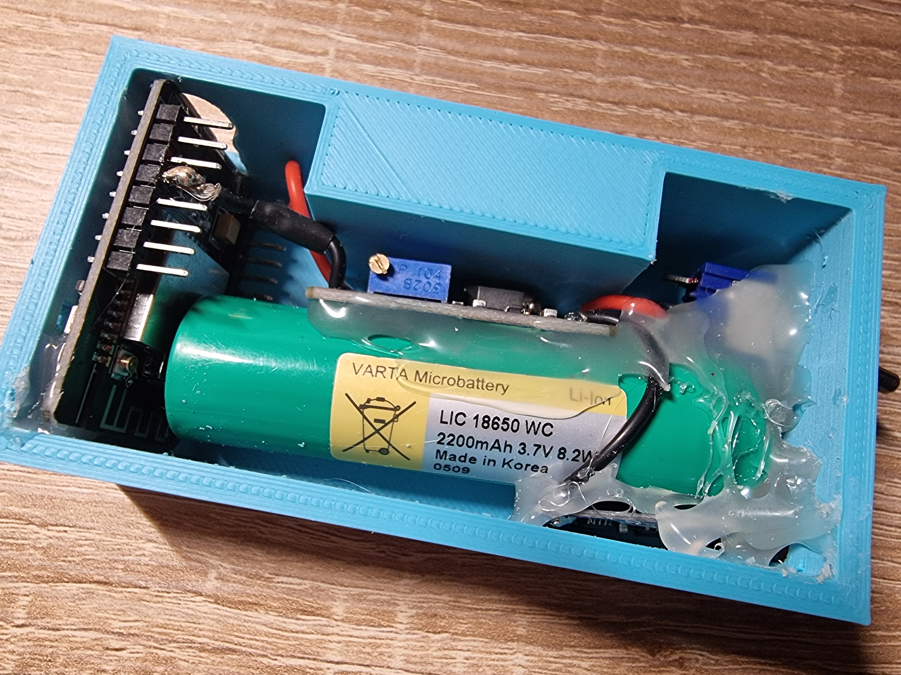
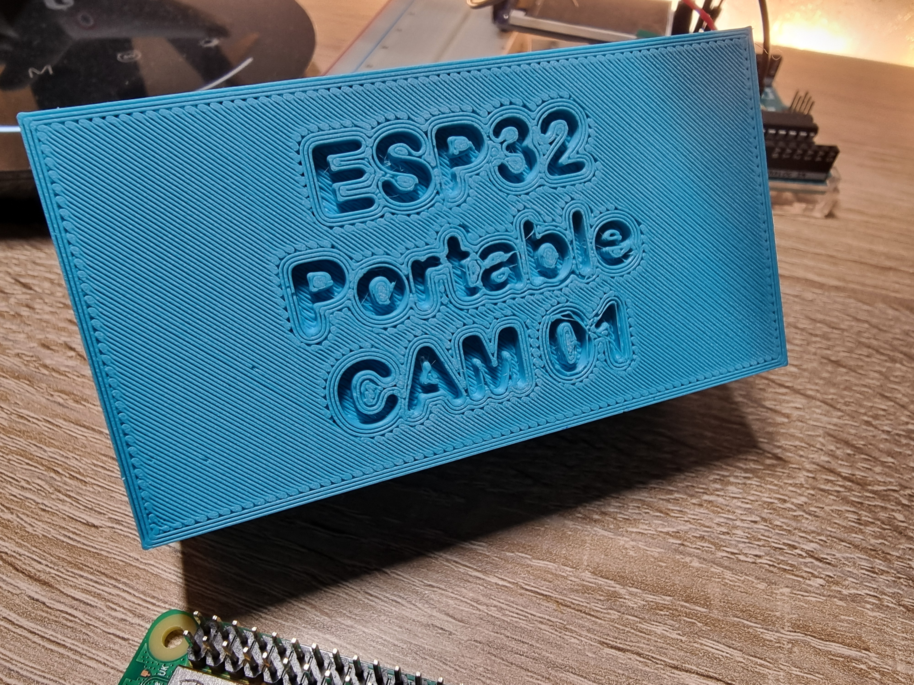

# ESP32-Cam WIFI 🎥

My aim for this project is to make a fully self-contained system allowing live video transmission as well as giving the user the ability to takes pictures that are saved to a MicroSD Card plugged directly into the device. The module works thanks to a 5V battery, a switch can be used to turn on/off the system, finally, a USB-C port makes charging very convenient.

## Hardware Required :

| **Part** | Image | Usual price |
| --- | :---: | :---: |
| **ESP32-CAM Module** |  | 4.50€ |
| **OV2640 Camera** |   | 2.80€ |
| **ESP32-CAM-MB Programmer Shield** |  | 1.60€ |
| **Battery (5V, 3.7V, …)** |  | * |
| **Charging module (TP4056)** |  | ~1€ |
| **A switch** |  | * |
| **DC-DC power supply adapter (if your battery ≠ 5V)** |  | ~1.5€ |
| **Low capacity MicroSD card (in FAT32 format)**  |  | * |

*\* depends on capacity/quality*

## Installation

Download this ZIP archive, change the credentials of the WIFI Access Point defined in the code :

```cpp
const char *ssid = "ESP32-CAM";
const char *password = "12345678";
```

Upload the code on your ESP32, using the micro-usb programmer. *If you use the Arduino IDE select “AI Thinker ESP32-CAM” as the targeted board.*

## Usage

Insert a microSD card in the slot on top of the module, then turn it on, you should now see a new WIFI available on your computer, just like this :

<p align="center">
	
</p>

Connect to it. Finally, open the HTML file with your web browser. You can take pictures or change the frame size of the stream in real time (high resolution can slow down the rate).

<p align="center">
	
</p>

## 3D printed case

<p align="center">
	
    
</p>

I provide you with the files allowing you to print a case suitable for a standard size cylindrical battery. There is also the hood to close it.

- Download the case.
- Download the hood.
